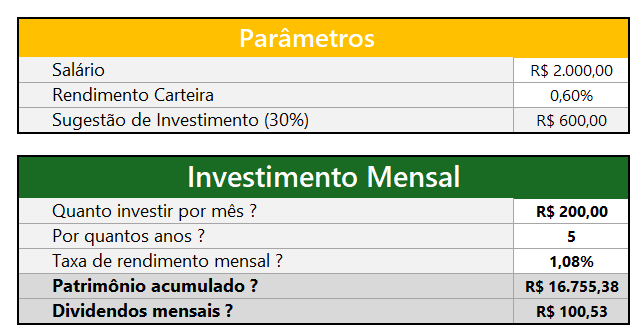
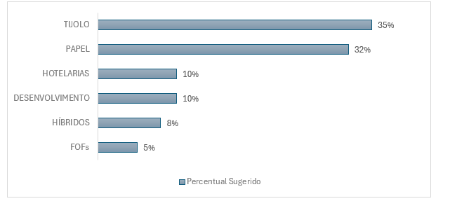
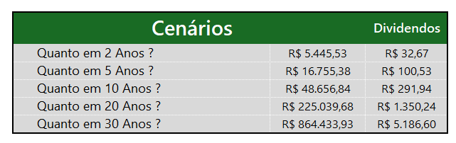

# Bootcamp Santander - Excel com Inteligência Artificial

Uma jornada completa para aprender Excel do zero, entendendo as principais fórmulas e dominando as principais práticas do mercado para tratar e exibir dados em relatórios com eficiência e o apoio da IA! 🚀 

# Desafio de Projeto

Este laboratório tem como objetivo tem como objetivo aplicar os conceitos de Excel no desenvolvimento de uma ferramenta prática de simulação de investimentos em fundos imobiliários. A partir de uma compreensão aprofundada sobre como os fundos imobiliários funcionam e as perguntas típicas dos investidores (quanto investir, por quanto tempo, taxa de rendimento, etc.), o desafio consiste em construir uma planilha que ajude o usuário a realizar essas simulações, auxiliando-o a tomar decisões mais informadas sobre seus investimentos. A solução proposta visa automatizar cálculos complexos, como o valor total investido, o patrimônio acumulado e os dividendos mensais, proporcionando ao usuário uma visão clara de seu potencial retorno.

# 📊 Simulador de Investimentos em Fundos Imobiliários (FIIs) - Excel

Este projeto tem como objetivo ajudar investidores a simular aportes em Fundos Imobiliários (FIIs), utilizando uma planilha Excel automatizada. A ferramenta permite simular diferentes cenários de investimento, considerando aportes mensais, tempo de aplicação e taxa de rendimento.

---

## 🚀 Funcionalidades

- Cálculo automático do **total investido**.
- Simulação da **evolução do patrimônio acumulado** mês a mês.
- Estimativa de **dividendos mensais** com base na taxa de rendimento.
- Gráficos de acompanhamento da performance do investimento.
- Design intuitivo com campos de entrada destacados.

---

## 🧮 Parâmetros de Simulação

O usuário pode ajustar os seguintes campos:

| Campo                      | Descrição                                              |
|---------------------------|--------------------------------------------------------|
| 💰 Valor Inicial Investido | Quanto será investido no início da simulação           |
| ➕ Aporte Mensal           | Valor que será adicionado a cada mês                   |
| 📅 Período (em meses)     | Por quantos meses o investimento será mantido          |
| 📈 Rendimento Mensal (%)  | Taxa de rendimento mensal esperada (ex: 0,7%)          |

---

## 📷 Exemplos Visuais

### 🧾 Planilha preenchida com simulação

### 📊 Gráfico de evolução patrimonial

### 📑 Resumo dos resultados

---

## 📂 Estrutura do Projeto

simulador-fundos-imobiliarios-excel/
├── README.md

├── Simulador_Investimentos_Fundos_Imobiliarios_Excel.xlsx

└── imagens/

├── simulacao-preenchida.png

├── grafico-evolucao-patrimonio.png

└── resumo-resultados.png

---

## 🛠️ Como Usar

1. Baixe o arquivo Excel.
2. Preencha os campos destacados em **amarelo** com os valores desejados.
3. Veja os resultados sendo atualizados automaticamente.
4. Acompanhe o gráfico de evolução patrimonial.

---

## 📌 Requisitos

- Microsoft Excel (2016 ou superior) ou Google Sheets (com ajustes).
- Habilitação de edição de fórmulas.

---

## 🧠 Aprendizados

Este projeto integra conhecimentos práticos de Excel com conceitos financeiros reais, permitindo uma visão clara e direta sobre o impacto de juros compostos e aportes regulares na formação de patrimônio.

---

## 🧑‍💻 Desenvolvido por

[Maurício Barros]  
🔗 [github.com/opusvix](https://github.com/opusvix)

---

## 📃 Licença

MIT
